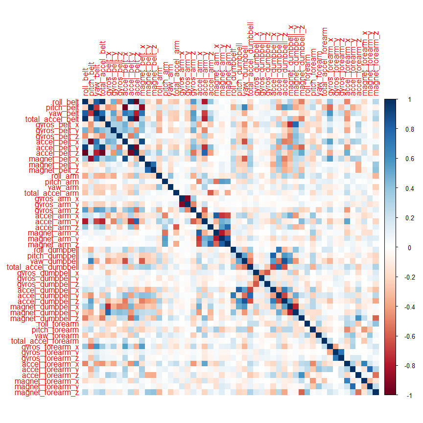
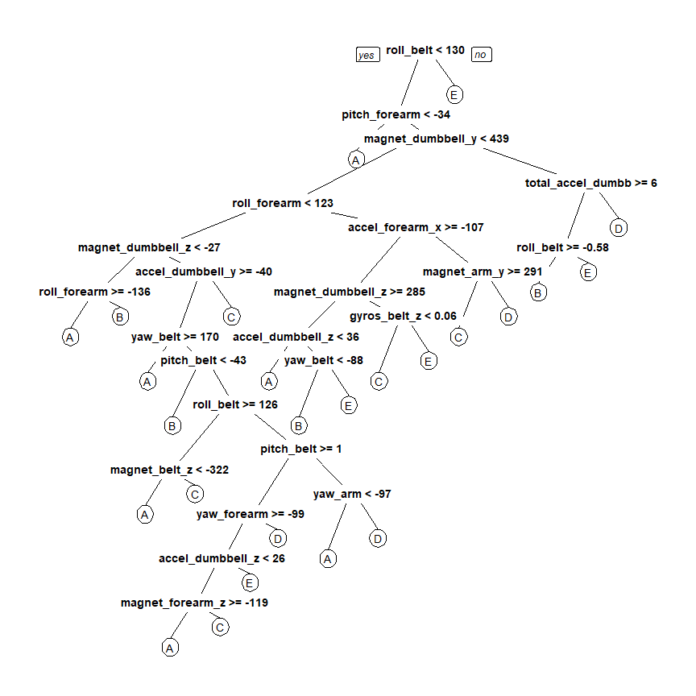

## Introduction  
Using devices such as Jawbone Up, Nike FuelBand, and Fitbit it is now possible to collect a large amount of data about personal activity relatively inexpensively. These type of devices are part of the quantified self movement - a group of enthusiasts who take measurements about themselves regularly to improve their health, to find patterns in their behavior, or because they are tech geeks. One thing that people regularly do is quantify how much of a particular activity they do, but they rarely quantify how well they do it.  

In this project, we will use data from accelerometers on the belt, forearm, arm, and dumbell of 6 participants to predict the manner in which they did the exercise.  

## Data Preprocessing  

```r
library(caret)
library(rpart)
library(rpart.plot)
library(randomForest)
library(corrplot)
```
### Download the Data

```r
trainUrl <-"https://d396qusza40orc.cloudfront.net/predmachlearn/pml-training.csv"
testUrl <- "https://d396qusza40orc.cloudfront.net/predmachlearn/pml-testing.csv"
trainFile <- "./data/pml-training.csv"
testFile  <- "./data/pml-testing.csv"
if (!file.exists("./data")) {
  dir.create("./data")
}
if (!file.exists(trainFile)) {
  download.file(trainUrl, destfile=trainFile, method="curl")
}
if (!file.exists(testFile)) {
  download.file(testUrl, destfile=testFile, method="curl")
}
```
### Read the Data
After downloading the data from the data source, we can read the two csv files into two data frames.  

```r
trainRaw <- read.csv("./data/pml-training.csv")
testRaw <- read.csv("./data/pml-testing.csv")
dim(trainRaw)
```

```
## [1] 19622   160
```

```r
dim(testRaw)
```

```
## [1]  20 160
```
The training data set contains 19622 observations and 160 variables, while the testing data set contains 20 observations and 160 variables. The "classe" variable in the training set is the outcome to predict. 

### Clean the data
In this step, we will clean the data and get rid of observations with missing values as well as some meaningless variables.

```r
sum(complete.cases(trainRaw))
```

```
## [1] 406
```
First, we remove columns that contain NA missing values.

```r
trainRaw <- trainRaw[, colSums(is.na(trainRaw)) == 0] 
testRaw <- testRaw[, colSums(is.na(testRaw)) == 0] 
```
Next, we get rid of some columns that do not contribute much to the accelerometer measurements.

```r
classe <- trainRaw$classe
trainRemove <- grepl("^X|timestamp|window", names(trainRaw))
trainRaw <- trainRaw[, !trainRemove]
trainCleaned <- trainRaw[, sapply(trainRaw, is.numeric)]
trainCleaned$classe <- classe
testRemove <- grepl("^X|timestamp|window", names(testRaw))
testRaw <- testRaw[, !testRemove]
testCleaned <- testRaw[, sapply(testRaw, is.numeric)]
```
Now, the cleaned training data set contains 19622 observations and 53 variables, while the testing data set contains 20 observations and 53 variables. The "classe" variable is still in the cleaned training set.

### Slice the data
Then, we can split the cleaned training set into a pure training data set (70%) and a validation data set (30%). We will use the validation data set to conduct cross validation in future steps.  

```r
set.seed(22519) # For reproducibile purpose
inTrain <- createDataPartition(trainCleaned$classe, p=0.70, list=F)
trainData <- trainCleaned[inTrain, ]
testData <- trainCleaned[-inTrain, ]
```

## Data Modeling
We fit a predictive model for activity recognition using **Random Forest** algorithm because it automatically selects important variables and is robust to correlated covariates & outliers in general. We will use **5-fold cross validation** when applying the algorithm.  

```r
controlRf <- trainControl(method="cv", 5)
modelRf <- train(classe ~ ., data=trainData, method="rf", trControl=controlRf, ntree=250)
modelRf
```

```
## Random Forest 
## 
## 13737 samples
##    52 predictor
##     5 classes: 'A', 'B', 'C', 'D', 'E' 
## 
## No pre-processing
## Resampling: Cross-Validated (5 fold) 
## Summary of sample sizes: 10989, 10991, 10988, 10989, 10991 
## Resampling results across tuning parameters:
## 
##   mtry  Accuracy   Kappa    
##    2    0.9909729  0.9885802
##   27    0.9914091  0.9891325
##   52    0.9849311  0.9809363
## 
## Accuracy was used to select the optimal model using the largest value.
## The final value used for the model was mtry = 27.
```
Then, we estimate the performance of the model on the validation data set.  

```r
predictRf <- predict(modelRf, testData)
confusionMatrix(testData$classe, predictRf)
```

```
## Confusion Matrix and Statistics
## 
##           Reference
## Prediction    A    B    C    D    E
##          A 1673    0    0    0    1
##          B    6 1129    4    0    0
##          C    0    0 1021    5    0
##          D    0    0   15  948    1
##          E    0    0    0    6 1076
## 
## Overall Statistics
##                                           
##                Accuracy : 0.9935          
##                  95% CI : (0.9911, 0.9954)
##     No Information Rate : 0.2853          
##     P-Value [Acc > NIR] : < 2.2e-16       
##                                           
##                   Kappa : 0.9918          
##  Mcnemar's Test P-Value : NA              
## 
## Statistics by Class:
## 
##                      Class: A Class: B Class: C Class: D Class: E
## Sensitivity            0.9964   1.0000   0.9817   0.9885   0.9981
## Specificity            0.9998   0.9979   0.9990   0.9968   0.9988
## Pos Pred Value         0.9994   0.9912   0.9951   0.9834   0.9945
## Neg Pred Value         0.9986   1.0000   0.9961   0.9978   0.9996
## Prevalence             0.2853   0.1918   0.1767   0.1630   0.1832
## Detection Rate         0.2843   0.1918   0.1735   0.1611   0.1828
## Detection Prevalence   0.2845   0.1935   0.1743   0.1638   0.1839
## Balanced Accuracy      0.9981   0.9989   0.9903   0.9926   0.9984
```

```r
accuracy <- postResample(predictRf, testData$classe)
accuracy
```

```
##  Accuracy     Kappa 
## 0.9935429 0.9918320
```

```r
oose <- 1 - as.numeric(confusionMatrix(testData$classe, predictRf)$overall[1])
oose
```

```
## [1] 0.006457094
```
So, the estimated accuracy of the model is 99.42% and the estimated out-of-sample error is 0.58%.

## Predicting for Test Data Set
Now, we apply the model to the original testing data set downloaded from the data source. We remove the `problem_id` column first.  

```r
result <- predict(modelRf, testCleaned[, -length(names(testCleaned))])
result
```

```
##  [1] B A B A A E D B A A B C B A E E A B B B
## Levels: A B C D E
```

## Appendix: Figures
1. Correlation Matrix Visualization  

```r
corrPlot <- cor(trainData[, -length(names(trainData))])
corrplot(corrPlot, method="color")
```

<!-- -->
2. Decision Tree Visualization

```r
treeModel <- rpart(classe ~ ., data=trainData, method="class")
prp(treeModel) # fast plot
```

<!-- -->
